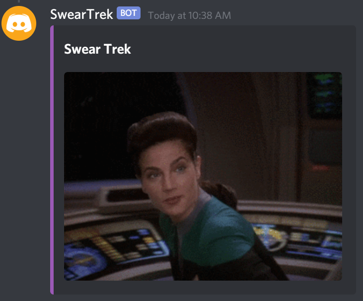

# SwearTrek

I made a Discord bot for my friends and I.  Calling up Swear Trek gifs is one part of it that I pulled out and made it's own repo.

I love Star Trek and Swear Trek, so I wanted to be able to call up a random Swear Trek gif on demand.

Type /st to pull the slash command in Discord after adding your own bot.
 

## Getting Started

- [ ] Clone the repo
- [ ] Create a bot in Discord.com/Developers
- [ ] Add a bot to your account
- [ ] Add bot and applications.commands to permissions under OAuth
- [ ] Copy the token
- [ ] At the root, create a file called .env
  - [ ] add the lines:  
     - [ ] GIPHY_API=Your_API_Token  
     - [ ] DISCORD_TOKEN=Discord_Bot_Token
- [ ] cd to the root
- [ ] Start the bot with Python3+     
